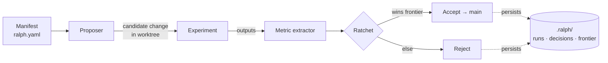

# ralph-research

[](https://github.com/coyaSONG/ralph-research/actions/workflows/ci.yml)
[](https://www.npmjs.com/package/ralph-research)
[](LICENSE)
[](package.json)
[](tsconfig.json)

Local-first runtime for recursive research improvement over real artifacts.

`ralph-research` ships an actual CLI and stdio MCP server that run a bounded loop:

1. load a manifest
2. generate one candidate change
3. evaluate it with trusted signals
4. persist the run, decision, and frontier state
5. promote only verified improvements



If your viewer does not render Mermaid: the diagram is just the five
numbered steps above, with every transition writing to durable state under
`.ralph/`. That's the bit that makes the loop resumable.

The current product bar is reliability, not breadth. The bundled success path is the `writing` template, while the runtime itself is manifest-driven and reusable for other local workflows.

## Trust Signals

- Actual shipped surfaces: CLI binary `rrx` and stdio MCP server
- Development verification commands: `npm test`, `npm run typecheck`, `npm run build`
- Persisted runtime evidence: runs, decisions, frontier, and lock metadata
- Recovery semantics are enforced by code and persisted state, not described only in prompts
- Supported onboarding path is intentionally narrower than the full manifest surface

## What It Is

- A Node/TypeScript runtime with a real CLI: `rrx`
- A stdio MCP server backed by the same service layer as the CLI
- A Git-aware candidate execution loop with persisted run, decision, and frontier state
- A local-first system designed to be resumed, inspected, and trusted after interruptions

## What It Is Not

- Not a no-config autonomous agent for arbitrary domains out of the box
- Not a hosted service
- Not a prompt-only protocol with undocumented runtime behavior
- Not broader than the shipped contract: one bundled template (`writing`) and three MCP tools

## Quick Decision Guide

| If you want to... | Use |
| --- | --- |
| Check whether a repo is runnable | `rrx validate` then `rrx doctor` |
| Materialize the bundled example project | `rrx init --template writing` (or `--template code`) |
| Run a disposable end-to-end demo | `rrx demo writing` (or `rrx demo code`) |
| Launch the v1 goal-driven orchestrator | `rrx "improve the holdout top-3 model"` |
| Launch the v1 goal-driven orchestrator explicitly | `rrx launch "improve the holdout top-3 model"` |
| Resume a persisted TUI research session | `rrx resume latest` |
| Execute one cycle | `rrx run --json` |
| Resume the latest recoverable run | `rrx run` |
| Force a fresh run id | `rrx run --fresh` |
| Inspect runtime and recovery state | `rrx status --json` |
| Inspect why one run was accepted or rejected | `rrx inspect <runId> --json` |
| Review the current accepted frontier | `rrx frontier --json` |
| Serve the same contract over MCP stdio | `rrx serve-mcp --stdio` |

## Five-Minute Start

For a guided walkthrough that ends with you reading the persisted
`decision.json` for an accepted cycle, see
[docs/quickstart.md](docs/quickstart.md). The compressed version:

### Option A: disposable demo

```bash
npx ralph-research demo writing   # prose ratchet
npx ralph-research demo code      # test-pass ratchet
```

Either command creates a temporary Git repo, runs one accepted cycle, and prints the temp path plus the run id.

### Option B: initialize a local repo

```bash
npx ralph-research init --template writing
npx ralph-research doctor
npx ralph-research run --json
npx ralph-research status --json
npx ralph-research inspect run-0001 --json
```

This is the current truth contract for the bundled template: `init -> run -> inspect` should succeed quickly on a local machine.

`rrx "goal"` now creates or refreshes the launch draft session and drops into the v1 TUI shell. Initial launch does not start an autonomous research cycle until the shell tells it to continue.

When you submit the review step, the shell materializes a real research session and hands control to the selected agent runtime. Once that interactive run returns, `launch-draft` is removed. The remaining persisted session is the only runtime record you need to inspect or resume.

Resume semantics are intentionally narrow:

- `rrx resume <sessionId>` only works for sessions that ended after a completed cycle checkpoint
- interrupted sessions are resumable because the runtime has durable evidence for the next cycle boundary
- a clean agent exit without `goal_achieved` or a completed checkpoint is treated as terminal and is not resumable

## Runtime Model

The runtime is manifest-driven. `ralph.yaml` defines the project, proposer, experiment, metrics, ratchet, and storage root. The service layer then:

- loads and validates the manifest
- acquires a durable lock
- classifies recovery against the latest persisted run
- executes or resumes a candidate
- writes run, decision, and frontier state under the storage root

See [docs/operation-model.md](docs/operation-model.md) for the full lifecycle and recovery model.

## Current Scope

- Bundled templates: `writing` (prose ratchet) and `code` (test-pass ratchet over a tiny calculator module)
- Default template metric: local command metric, no API key required
- Optional judge path: pairwise LLM judge packs
- MCP tools:
  - `run_research_cycle`
  - `get_research_status`
  - `get_frontier`

The runtime supports broader manifests than the bundled template demonstrates, but the shipped onboarding path is intentionally narrow until those flows are equally reliable.

## Bundled Templates

### Writing template

Self-contained prose improvement loop:

- `docs/draft.md`: sample draft
- `scripts/propose.mjs`: bounded rewrite
- `scripts/experiment.mjs`: output materialization
- `scripts/metric.mjs`: local heuristic metric
- `prompts/judge.md`: pairwise judge prompt starter

`templates/writing/ralph.yaml` uses a local command metric by default, so the first run works without model credentials.

### Code template

Self-contained test-pass ratchet over a tiny calculator module:

- `src/calculator.mjs`: deliberately-broken `sum`/`multiply`
- `tests/calculator.test.mjs`: four assertions using the built-in `node:test` runner
- `scripts/propose.mjs`: writes the fixed calculator implementation
- `scripts/experiment.mjs`: runs `node --test --test-reporter=tap` and persists the pass/fail counts
- `scripts/metric.mjs`: emits the pass count as the `tests_passed` metric

`rrx demo code` materializes the template, runs one cycle, and shows the ratchet promoting the candidate from `tests_passed: 0` to `tests_passed: 4`.

## Progressive Runs

`rrx run` executes one cycle by default and auto-resumes the latest recoverable run when one exists.

Progressive stop modes are opt-in:

- `--fresh`: start a new `runId` instead of auto-resuming the latest recoverable run
- `--until-target`: keep iterating until `manifest.stopping.target` is met
- `--until-no-improve N`: stop after `N` consecutive cycles without frontier improvement
- `--cycles N` with a progressive flag: treat `N` as a max-cycle cap instead of an exact count

The bundled `writing` template ships with `stopping.target` commented out, so enable that block in `ralph.yaml` before using `--until-target`.

```bash
npx ralph-research run --until-target --until-no-improve 3 --json
```

## More Docs

- [docs/quickstart.md](docs/quickstart.md): five-minute walkthrough from `npx ralph-research demo writing` to inspecting the persisted decision evidence
- [docs/operation-model.md](docs/operation-model.md): lifecycle, persisted state, recovery classes
- [docs/playbook.md](docs/playbook.md): situation-to-command operator guide
- [docs/examples.md](docs/examples.md): quickstart and manifest examples pulled from shipped templates and fixtures
- [docs/examples-catalog.md](docs/examples-catalog.md): broader scenario catalog grounded in shipped templates and test fixtures
- [docs/comparison.md](docs/comparison.md): why this runtime is narrower and more stateful than prompt-only loop systems
- [docs/faq.md](docs/faq.md): common runtime, recovery, and inspection questions
- [docs/knowledge/INDEX.md](docs/knowledge/INDEX.md): project knowledge log

## CLI

```text
rrx "improve the holdout top-3 model"
rrx launch "improve the holdout top-3 model"
rrx resume latest
rrx validate
rrx doctor
rrx init --template writing
rrx demo writing
rrx run
rrx run --fresh
rrx run --until-target
rrx run --until-no-improve 3
rrx run --until-target --until-no-improve 3
rrx status
rrx frontier
rrx inspect <runId>
rrx accept <runId>
rrx reject <runId>
rrx serve-mcp --stdio
```

## Core Concepts

- `Manifest`: `ralph.yaml` defines the research program
- `Metric`: how candidate quality is measured
- `Frontier`: the currently accepted best candidate set
- `Ratchet`: the acceptance policy that decides whether the frontier advances
- `Proposer`: how a bounded candidate change is generated
- `Judge`: how qualitative outputs are compared when numeric metrics are not enough

## Development

```bash
npm install
npm test
npm run typecheck
npm run build
```

## Support the Project

If `ralph-research` saves you from wiring up your own write-evaluate-accept loop:

- Star the repo on [GitHub](https://github.com/coyaSONG/ralph-research). It is the single clearest signal that the runtime is worth maintaining and helps surface it to other people who need the same shape of tool.
- File issues with concrete reproductions. The issue templates ask for the version, OS, and exact commands so they convert quickly into fixes.
- Open a PR for the gaps you actually hit. `CONTRIBUTING.md` covers the local loop; the bar is a Vitest regression that fails against the previous code.
- If you want to talk shape and direction rather than file an issue, the manifest schema (`src/core/manifest/schema.ts`) and the recovery classifier (`src/core/state/research-session-recovery-classifier.ts`) are the two surfaces I most want feedback on.

## License

MIT
